# NyayaSetu — bridge to justice

About three in four people in Indian prisons are undertrials. Section 479 BNSS (earlier s.436A CrPC) says an undertrial
who has served half the maximum sentence — one-third for a first-time offender — must be released on bail, and no
undertrial may be held beyond the maximum. Very few eligible people are identified, because records are scattered and
multilingual and most prisoners have no lawyer.

NyayaSetu builds each prisoner's legal picture from messy records, computes eligibility **deterministically**, monitors
every prisoner continuously, surfaces every lawful route to release or acquittal for the assigned legal-aid lawyer, and
drafts grounded applications for the lawyer to review.

> Decision support for a qualified lawyer. **Not legal advice.** All legal data in this repository is **unverified**
> (see [docs/LEGAL_DATA.md](docs/LEGAL_DATA.md)) and all prisoner data is **synthetic**.

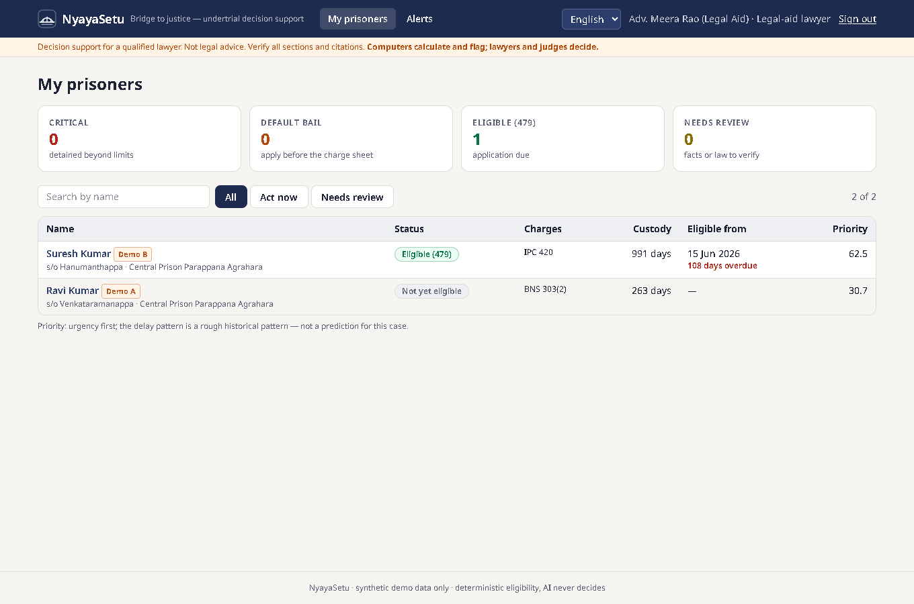

## What it does

| | |
|---|---|
| **Eligibility engine** | Pure-Python rule engine: 479 thresholds, absolute ceiling, default bail, bail-not-furnished, time served. Step-by-step reasoning trace, confidence gating, both readings of contested law. 100% branch coverage. |
| **Custody timeline** | Merges police/judicial/hospital custody, excludes bail and abscondence, handles transfers, re-arrests, conflicting arrest dates, custody in other cases. |
| **Ingestion & extraction** | PDF/JPG/PNG/DOCX/TXT → OpenCV preprocessing → Tesseract (eng+hin+kan) → document classifier → form/regex extractors (Kannada & Hindi numerals and months, dd/mm ambiguity, OCR slips, section strings like `379 r/w 34`) ⨉ optional LLM with verbatim evidence quotes. Every fact keeps its source span. |
| **Entity resolution** | Transliteration, honorific/alias handling, Indian-name phonetic keys, blocking, trained pairwise model, precision-first clustering, reversible merges. |
| **Delay attribution** | Rules → text classifier → LLM fallback; only the accused's own delay is subtracted; unknowns never are. |
| **Defense Insight Engine** | Lawyer-only: arrest safeguards, evidence gaps, charge-level arguments, faster exits (plea bargaining, compounding, probation), speedy trial, and similar judgments retrieved — never generated. Every insight cites record spans. |
| **Grounded drafting** | 479, default bail, regular bail, surety relief, speedy trial, plea bargaining, discharge — English and Kannada, DOCX/PDF. A verifier checks every date, section, number, name and citation against the sentence's sources. |
| **Monitoring** | Nightly idempotent recompute; alerts at 30/7/0 days, overdue, critical, default-bail windows, document-triggered changes; escalation. |
| **Dashboards** | Lawyer, jail staff, DLSA/UTRC heatmap and workload, reviewer queue, admin legal-data verification and audit log. |

## Architecture

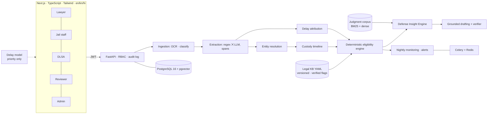

LLMs extract, classify, summarise and draft. **Only the rule engine decides eligibility.**

## Run it

### Docker (one command)
```bash
cp .env.example .env
docker compose up -d --build
make seed
```
Web: http://localhost:3000 · API docs: http://localhost:8000/docs

### Local (no Docker)
```bash
python -m venv .venv && .venv/Scripts/pip install -r backend/requirements.txt   # or .venv/bin/pip
cd backend && NYAYA_DEMO_MODE=true python -m app.seed --reset   # loads the two demo prisoners (add --full for edge cases)
uvicorn app.main:app --port 8000
cd ../frontend && npm install && npm run dev
```
SQLite is used when `NYAYA_DATABASE_URL` is not set. OCR of scanned images needs the Tesseract binary with `eng`, `hin`
and `kan` packs (text PDFs, DOCX and TXT work without it).

### Demo accounts (synthetic, local only)
Password for all: `nyaya-demo-2026`

| Role | Email |
|---|---|
| Legal-aid lawyer | lawyer@nyayasetu.test |
| Jail staff | jail@nyayasetu.test |
| DLSA / UTRC | dlsa@nyayasetu.test |
| Reviewer | reviewer@nyayasetu.test |
| System admin | admin@nyayasetu.test |

The demo data is exactly two synthetic prisoners: **Ravi Kumar** (not yet eligible: 242 counted days vs a 366-day
threshold) and **Suresh Kumar** (eligible: 961 vs 853). A walkthrough — including adding a prisoner, the reviewer's
check, assigning a lawyer, a new lawyer, access restriction, Kannada/Hindi and the audit log — is in
[docs/DEMO.md](docs/DEMO.md).

### Who does what
| Role | Does | Does not see |
|---|---|---|
| System admin | dashboard: prisoner register, **add prisoners**, assign lawyers, lawyer & user accounts, legal data, audit log | case details, documents, Defense Insights, drafts |
| Reviewer | checks new prisoners' details, uncertain extractions, delay attribution, identity matches | prisoner files outside the queue |
| Legal-aid lawyer | **only assigned prisoners**: full case, documents (**only the lawyer uploads**), Defense Insights, drafts | anyone else's prisoners |
| Jail staff | own jail: add prisoners, transfers, releases, case outcomes, superintendent's application | Defense Insights, lawyers' drafts |
| DLSA / UTRC | own district: dashboard, workload, assignment, lawyer accounts | Defense Insights, lawyers' drafts |

A new prisoner goes to the review queue first; a lawyer can be assigned only after the reviewer verifies it. All of this
is enforced by the API, not just hidden in the UI.

### Deploying (beyond the demo)
- `NYAYA_DEMO_MODE=false` — the sign-in page then hides the demo-account list and legal data is **not** auto-verified.
- Create real accounts through the admin screen; do not load the demo seed (`app.seed` creates the fixed demo users).
- `NYAYA_JWT_SECRET` = 64+ random characters; `NYAYA_DOCUMENTS_ENCRYPTION_KEY` = a Fernet key (documents encrypted at rest).
- `NYAYA_DATABASE_URL` = PostgreSQL (Docker Compose provides one); run `alembic upgrade head` for schema changes.
- `NYAYA_CORS_ORIGINS` and `NEXT_PUBLIC_API_URL` = your real HTTPS origins; serve both behind HTTPS.
- Build the web app with `npm run build && npm start` (security headers are set in `next.config.ts`).
- Verify every legal-data record against the official text (Admin → Legal data) before relying on any result.

### Optional: Claude for extraction and drafting polish
Set `NYAYA_LLM_PROVIDER=anthropic` and `NYAYA_ANTHROPIC_API_KEY`. Default model `claude-opus-5-5`, structured JSON
outputs validated by Pydantic, prompts versioned in `prompts/`. Without a key everything still works deterministically.

## Tests
```bash
cd backend && python -m pytest                    # unit, regression, API flow tests + the 1,000 synthetic scenarios
cd backend && python -m app.scenario_check        # full 1,000-scenario run incl. ~13k-request authorization sweep → docs/TEST_REPORT.md
make coverage                                     # eligibility engine branch coverage
cd frontend && npm run check:i18n                 # every UI string in English, Kannada and Hindi; no hard-coded text
cd frontend && PW_CHANNEL=chrome npx playwright test   # UI flows, desktop + mobile (needs the seeded API)
python ml/train_er.py && python ml/train_delay_model.py
cd backend && python -m app.evaluation            # writes docs/EVALUATION.md
```
Results of the latest run: [docs/TEST_REPORT.md](docs/TEST_REPORT.md).

## Screenshots
All from the default demo (two synthetic prisoners). Regenerate with
`SCREENSHOTS=1 PW_CHANNEL=chrome npx playwright test screenshots --project=desktop` in `frontend/`.

| | |
|---|---|
| **Sign in** — demo accounts appear only in demo mode 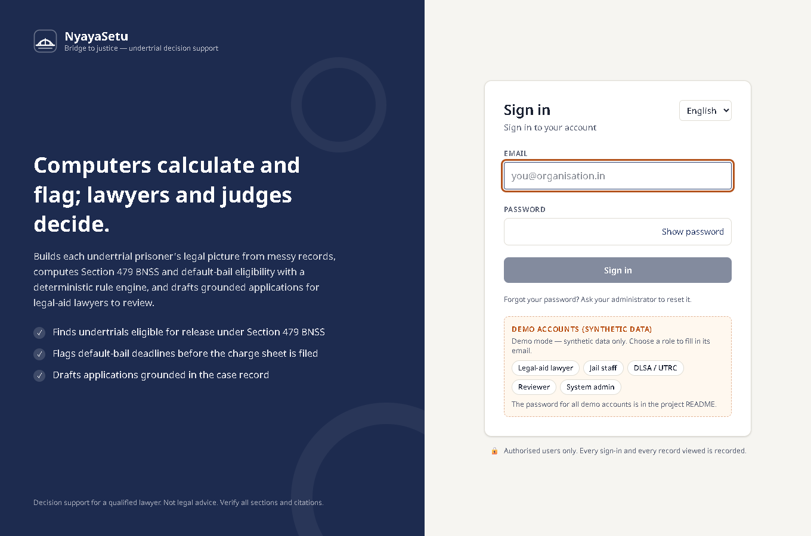 | **Lawyer's dashboard** — only assigned prisoners  |
| **Ravi Kumar — not eligible**: 263 − 21 = 242 < 366 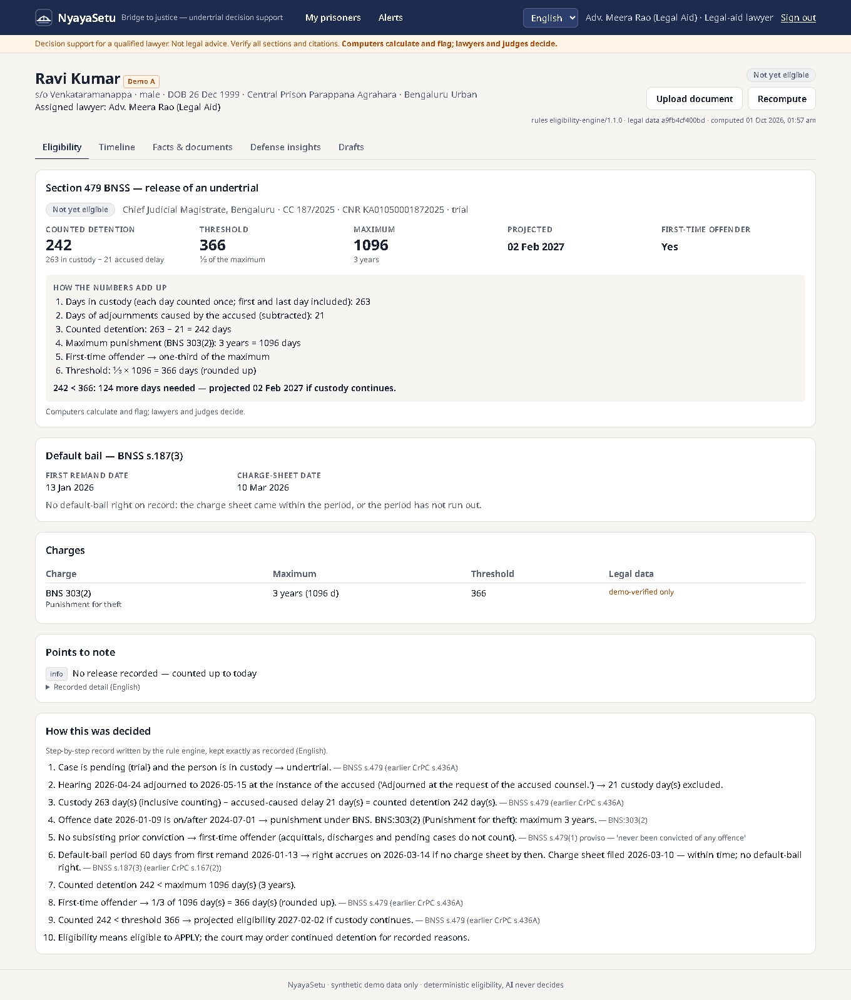 | **Suresh Kumar — eligible**: 991 − 30 = 961 ≥ 853 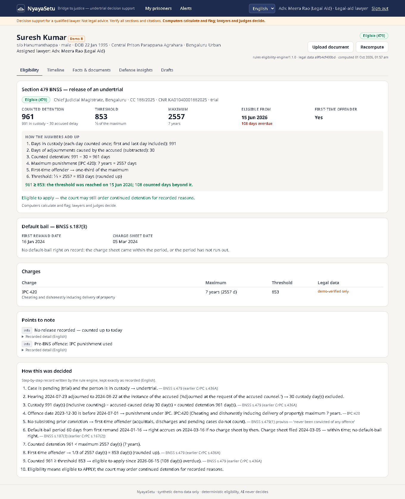 |
| **Timeline** — custody, hearings coloured by who caused the delay 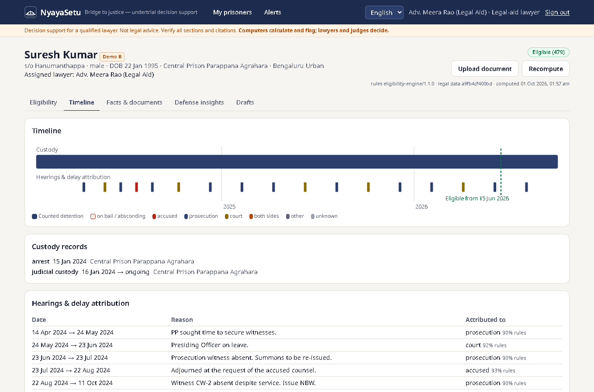 | **Source highlights** — every fact at its place in the document 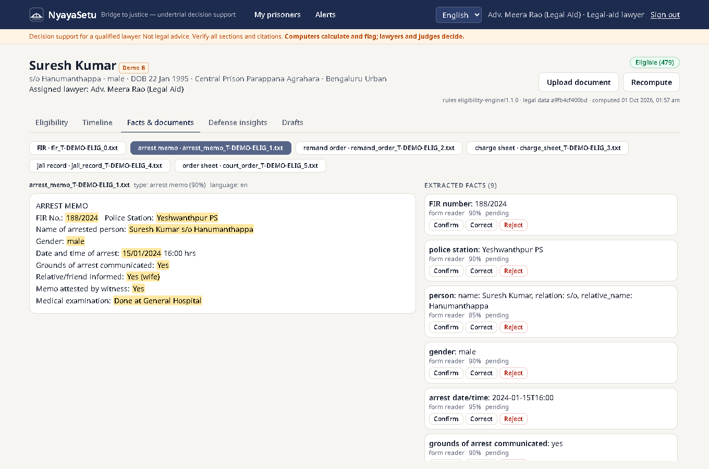 |
| **Defense Insights** — assigned lawyer only 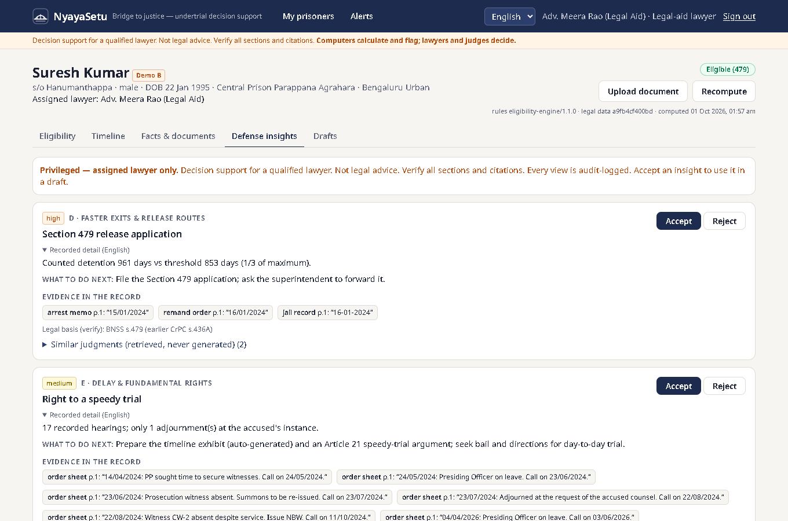 | **Grounded draft** — every sentence checked by the verifier 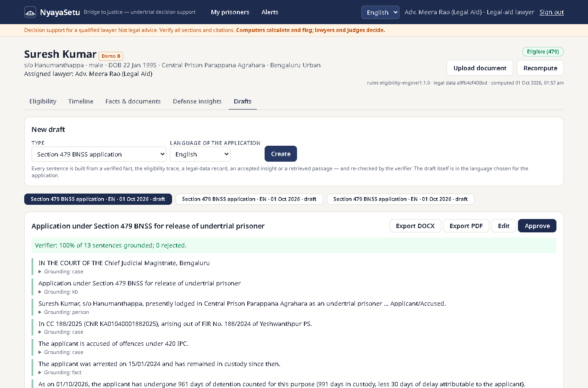 |
| **ಕನ್ನಡ** 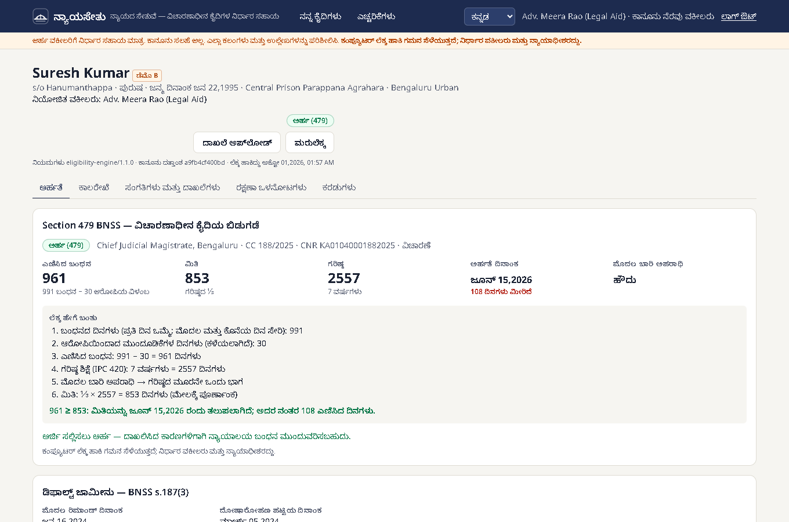 | **हिन्दी** 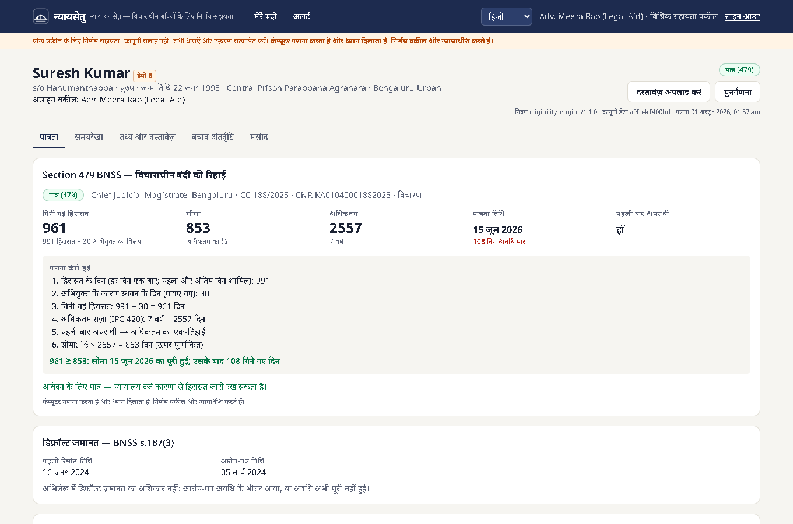 |
| **Admin** — register, lawyer assignment after review, audit log, users 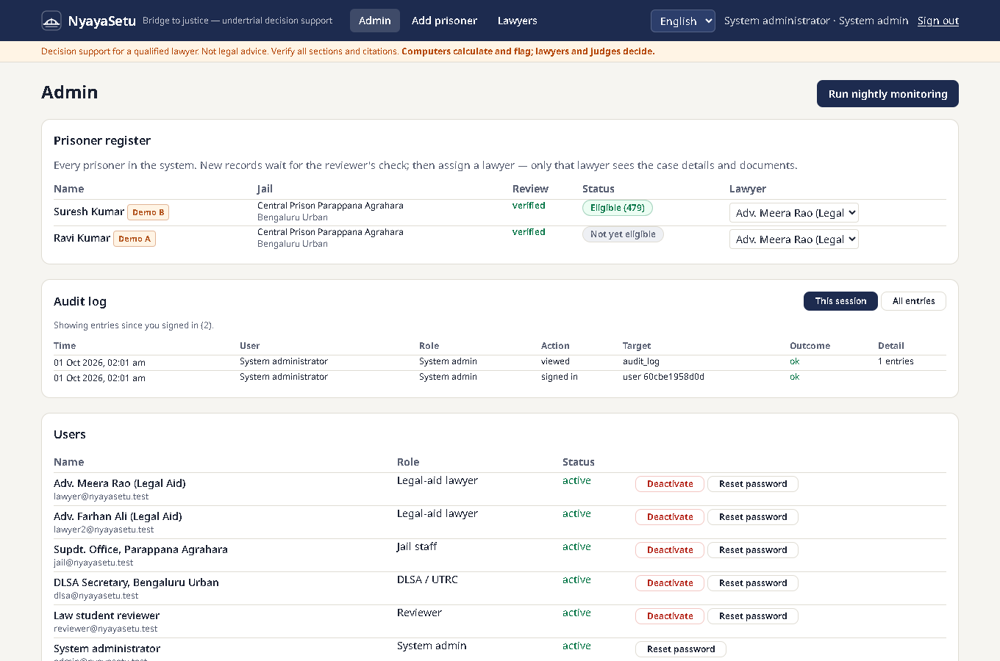 | **Reviewer** — review queue 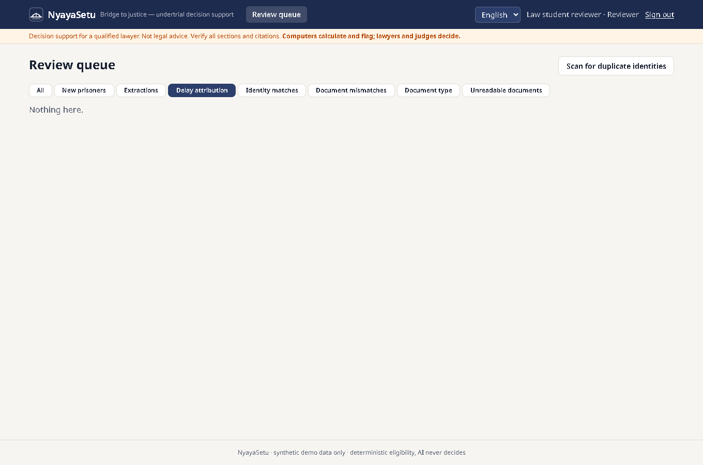 |
| **DLSA / UTRC** — district heatmap and workload 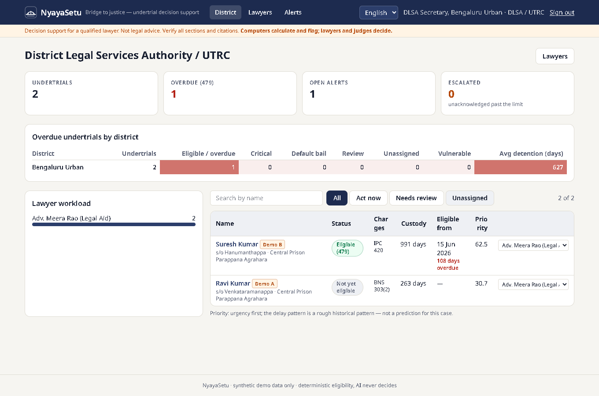 | **Phone** 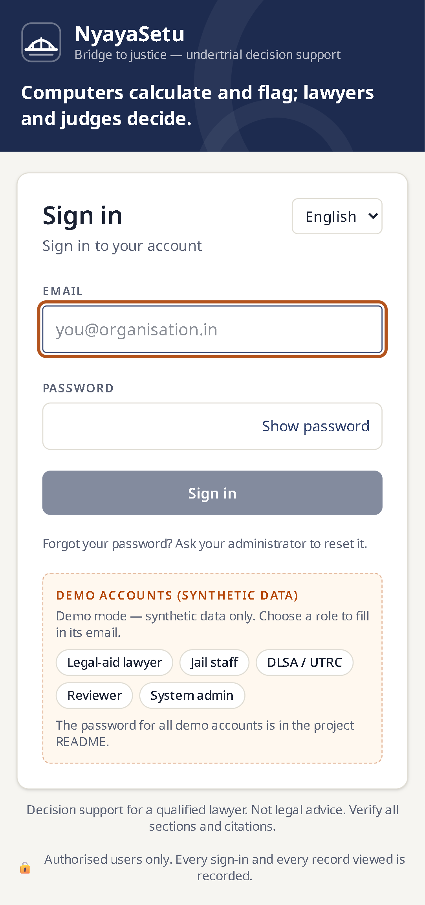 |

## Documentation
[PLAN](docs/PLAN.md) · [DECISIONS](docs/DECISIONS.md) · [EVALUATION](docs/EVALUATION.md) ·
[PRIVACY](docs/PRIVACY.md) · [LEGAL_DATA](docs/LEGAL_DATA.md) · [DEMO](docs/DEMO.md) · [TEST_REPORT](docs/TEST_REPORT.md)

## Repository layout
```
backend/app/   api core models schemas ingestion extraction resolution timeline delays legal_kb
               eligibility defense drafting prediction monitoring services  (+ seed.py, evaluation.py, worker.py)
backend/tests/ pytest suite
frontend/      Next.js app + Playwright e2e
data/legal/    versioned legal YAML   data/synthetic/  generator   data/judgments/  retrieval corpus
data/external/ download instructions (DDL eCourts, HC judgments) — no data committed
prompts/       versioned LLM prompts   ml/  training scripts, models, reports   docs/
```

## Known limitations
- Legal data unverified; demo mode simulates verification with a visible label.
- Evaluation is on synthetic data; real-world numbers need reviewed real (anonymised) records.
- The shipped judgment corpus is a labelled synthetic test corpus; load the public HC corpus for real use.
- Delay model trained on a synthetic stand-in until DDL files are downloaded.
- The UI is fully translated into Kannada and Hindi; the engine's rule-by-rule trace and recorded details stay in
  English (labelled). Drafts can be generated in English and Kannada (not Hindi); Kannada drafts need review by a
  Kannada-speaking lawyer. Translations were written without a native-speaker review.
- Identity resolution proposes only part of the true same-person pairs in the synthetic set (see TEST_REPORT); the
  rest depend on a reviewer noticing. It never merges automatically.
- Document facts do not update the case record by themselves; a contradicting document sends the case to REVIEW and
  a person corrects the record.
