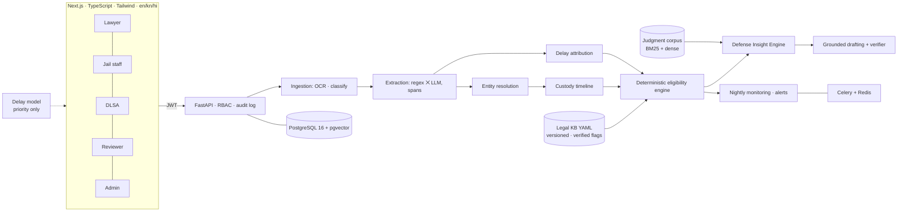

# NyayaSetu — bridge to justice

About three in four people in Indian prisons are undertrials. Section 479 BNSS (earlier s.436A CrPC) says an undertrial
who has served half the maximum sentence — one-third for a first-time offender — must be released on bail, and no
undertrial may be held beyond the maximum. Very few eligible people are identified, because records are scattered and
multilingual and most prisoners have no lawyer.

NyayaSetu builds each prisoner's legal picture from messy records, computes eligibility **deterministically**, monitors
every prisoner continuously, surfaces every lawful route to release or acquittal for the assigned legal-aid lawyer, and
drafts grounded applications for the lawyer to review.

> Decision support for a qualified lawyer. **Not legal advice.** All legal data in this repository is **unverified**
> (see [docs/LEGAL_DATA.md](docs/LEGAL_DATA.md)) and all prisoner data is **synthetic**.


## What it does

| | |
|---|---|
| **Eligibility engine** | Pure-Python rule engine: 479 thresholds, absolute ceiling, default bail, bail-not-furnished, time served. Step-by-step reasoning trace, confidence gating, both readings of contested law. 100% branch coverage. |
| **Custody timeline** | Merges police/judicial/hospital custody, excludes bail and abscondence, handles transfers, re-arrests, conflicting arrest dates, custody in other cases. |
| **Ingestion & extraction** | PDF/JPG/PNG/DOCX/TXT → OpenCV preprocessing → Tesseract (eng+hin+kan) → document classifier → form/regex extractors (Kannada & Hindi numerals and months, dd/mm ambiguity, OCR slips, section strings like `379 r/w 34`) ⨉ optional LLM with verbatim evidence quotes. Every fact keeps its source span. |
| **Entity resolution** | Transliteration, honorific/alias handling, Indian-name phonetic keys, blocking, trained pairwise model, precision-first clustering, reversible merges. |
| **Delay attribution** | Rules → text classifier → LLM fallback; only the accused's own delay is subtracted; unknowns never are. |
| **Defense Insight Engine** | Lawyer-only: arrest safeguards, evidence gaps, charge-level arguments, faster exits (plea bargaining, compounding, probation), speedy trial, and similar judgments retrieved — never generated. Every insight cites record spans. |
| **Grounded drafting** | 479, default bail, regular bail, surety relief, speedy trial, plea bargaining, discharge — English and Kannada, DOCX/PDF. A verifier checks every date, section, number, name and citation against the sentence's sources. |
| **Monitoring** | Nightly idempotent recompute; alerts at 30/7/0 days, overdue, critical, default-bail windows, document-triggered changes; escalation. |
| **Dashboards** | Lawyer, jail staff, DLSA/UTRC heatmap and workload, reviewer queue, admin legal-data verification and audit log. |

## Architecture



LLMs extract, classify, summarise and draft. **Only the rule engine decides eligibility.**

## Run it

### Docker (one command)
```bash
cp .env.example .env
docker compose up -d --build
make seed
```
Web: http://localhost:3000 · API docs: http://localhost:8000/docs

### Local (no Docker)
```bash
python -m venv .venv && .venv/Scripts/pip install -r backend/requirements.txt   # or .venv/bin/pip
cd backend && NYAYA_DEMO_MODE=true python -m app.seed --reset
uvicorn app.main:app --port 8000
cd ../frontend && npm install && npm run dev
```
SQLite is used when `NYAYA_DATABASE_URL` is not set. OCR of scanned images needs the Tesseract binary with `eng`, `hin`
and `kan` packs (text PDFs, DOCX and TXT work without it).

### Demo accounts (synthetic, local only)
Password for all: `nyaya-demo-2026`

| Role | Email |
|---|---|
| Legal-aid lawyer | lawyer@nyayasetu.test |
| Jail staff | jail@nyayasetu.test |
| DLSA / UTRC | dlsa@nyayasetu.test |
| Reviewer | reviewer@nyayasetu.test |
| System admin | admin@nyayasetu.test |

A 2-minute walkthrough is in [docs/DEMO.md](docs/DEMO.md).

### Optional: Claude for extraction and drafting polish
Set `NYAYA_LLM_PROVIDER=anthropic` and `NYAYA_ANTHROPIC_API_KEY`. Default model `claude-opus-5-5`, structured JSON
outputs validated by Pydantic, prompts versioned in `prompts/`. Without a key everything still works deterministically.

## Tests
```bash
cd backend && python -m pytest                    # 88 tests: all 58 named checklist items + branch tests
make coverage                                     # eligibility engine: 100% branch coverage
cd frontend && npx playwright test                # key UI flows, desktop + mobile (needs the seeded API)
python ml/train_er.py && python ml/train_delay_model.py
cd backend && python -m app.evaluation            # writes docs/EVALUATION.md
```

## Screenshots
| | |
|---|---|
|  |  |
|  |  |
|  |  |

## Documentation
[PLAN](docs/PLAN.md) · [DECISIONS](docs/DECISIONS.md) · [EVALUATION](docs/EVALUATION.md) ·
[PRIVACY](docs/PRIVACY.md) · [LEGAL_DATA](docs/LEGAL_DATA.md) · [DEMO](docs/DEMO.md)

## Repository layout
```
backend/app/   api core models schemas ingestion extraction resolution timeline delays legal_kb
               eligibility defense drafting prediction monitoring services  (+ seed.py, evaluation.py, worker.py)
backend/tests/ pytest suite
frontend/      Next.js app + Playwright e2e
data/legal/    versioned legal YAML   data/synthetic/  generator   data/judgments/  retrieval corpus
data/external/ download instructions (DDL eCourts, HC judgments) — no data committed
prompts/       versioned LLM prompts   ml/  training scripts, models, reports   docs/
```

## Known limitations
- Legal data unverified; demo mode simulates verification with a visible label.
- Evaluation is on synthetic data; real-world numbers need reviewed real (anonymised) records.
- The shipped judgment corpus is a labelled synthetic test corpus; load the public HC corpus for real use.
- Delay model trained on a synthetic stand-in until DDL files are downloaded.
- Hindi UI is scaffolded (falls back to English); Kannada drafts need review by a Kannada-speaking lawyer.
